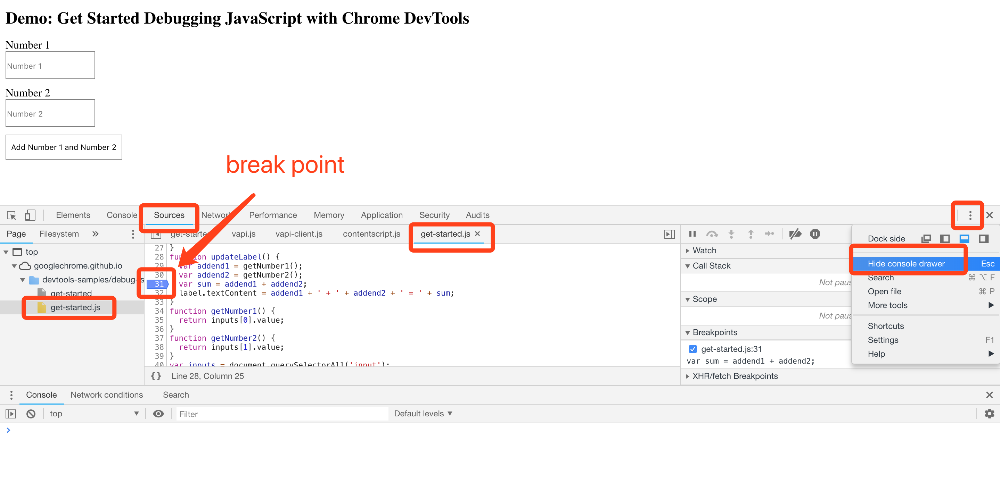
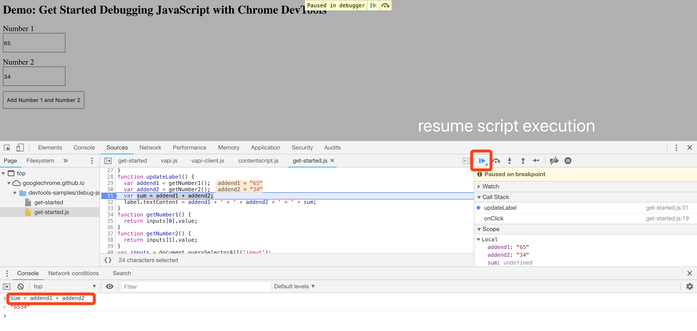

# Debug JS

Debug JS code with chrome dev tool.

## Open the URL and Console

https://googlechrome.github.io/devtools-samples/debug-js/get-started

1. Click source tab
2. Select the source file in left panel tree
3. Create a break point in the line of source code editor
4. Show the console drawer in the right corner

## Start debugging

Click the button on the web, manually apply code fix in console.

1. Resume code execution
2. Edit source code in code editor and ctrl+s
3. Deactivate the break point

## Click and run on web page

Start verification on web page.

