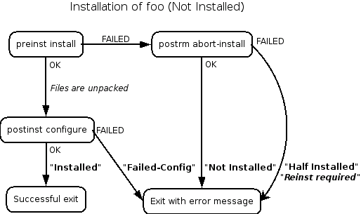
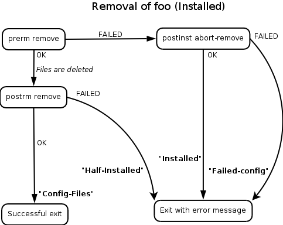
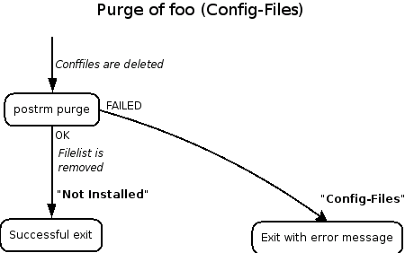
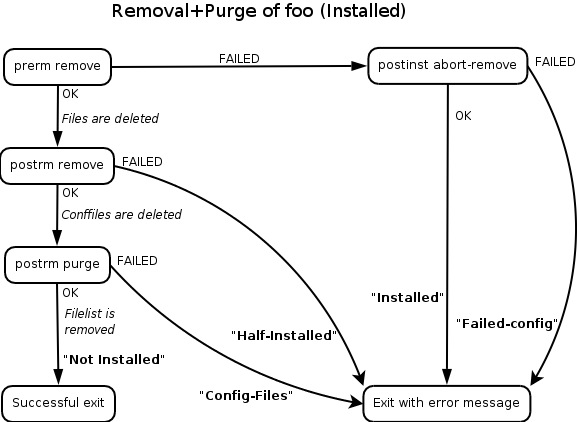
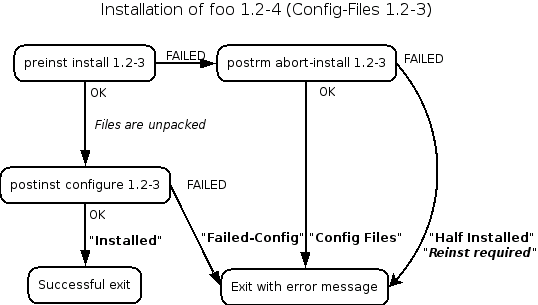
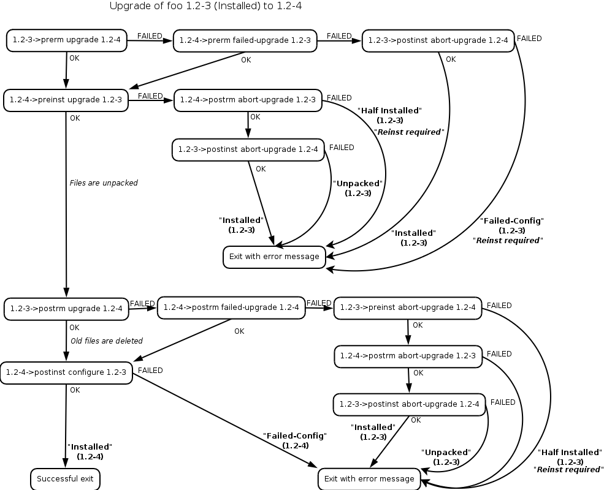

# 怎样打包

Debian 包分两类，一类是源码包，另一类是二进制包。分别是从源码打包成 .deb 包，从二进制文件打包成 .deb 包。

## 从源码打包

从源码打包时，目录名叫作`debian`，里面主要的文件有`control`，`copyright`，`changelog`，`rules`等。

最终编译出来的二进制文件是通过`make install DESTDIR=$(CURDIR)/debian/pkgname`来移动到`debian`目录里的，然后再将`debian`目录打成`deb`包，其中`$(CURDIR)`是一个特殊变量是`debian`目录的父目录，而不是运行这条命令(`make install`)的当前目录。

相关内容参考该目录下的相关文件。
```
$ git clone https://github.com/apache/mesos
$ cd mesos
$ cp -r debian .
$ dpkg-buildpackage -us -uc
```

NOTE: `dpkg-buildpackage -us -uc` will do everything to make full binary and source packages for you. It will:

* clean the source tree (**debian/rules clean**)
* build the source package (**dpkg-source -b**)
* build the program (**debian/rules build**)
* build binary packages (**fakeroot debian/rules binary**)
* make the .dsc file
* make the .changes file, using dpkg-genchanges

If the build result is satisfactory one, sign the .dsc and .changes files with your private GPG key using the debsign command. You need to enter your secret pass phrase, twice.

## 从二进制文件打包

从预编译好的二进制文件打包时，目录名叫作`DEBIAN`，里面主要的文件有`control`和`changelog`。

这两个文件的相关内容可参考同级目录下的`DEBIAN`目录。

二进制文件打包的目录结构如下：

```
mesos
|-- ./DEBIAN
|   |-- ./DEBIAN/changelog
|   `-- ./DEBIAN/control
|-- ./etc
|   `-- ./etc/mesos
|       |-- ./etc/mesos/mesos-master.conf
|       `-- ./etc/mesos/mesos-slave.conf
`-- ./usr
    `-- ./usr/bin
        |-- ./usr/bin/mesos-master
        `-- ./usr/bin/mesos-slave
```

切换到`DEBIAN`所在的目录执行以下命令：

```
$ dpkg -b . mesos_0.25.0-1_amd64.deb
```

## MaintainerScripts

These postinst, preinst, postrm, and prerm files are called maintainer scripts. They are scripts which are put in the control area of the package and run by dpkg when your package is installed, upgraded, or removed.

* 安装（apt-get install），全新安装一个包，这个包从来没有被安装过。

    

* 删除（apt-get remove），删除一个已经安装的包。

    

* 清空（apt-get purge），意思是清空包的配置文件。通常当删除（apt-get remove）一个包之后并不能删除它的配置文件，需要再运行一下清空命令。下面的图片表示在删除包之后运行`apt-get purge`的流程。

    

* 删除和清空，意思是当一个包在已经安装状态时用`apt-get purge`用一步删除和清空。

    

* Installing from '''Config-Files''' state

    

* 升级

    

* 降级

好麻烦啊。。。

## 问题

### dh_usrlocal: xxx is not a directory

当在`debian/rules`文件里设置`./configure --prefix=/usr/local/xxx`时会报如下错误：

```
dh_usrlocal: xxx is not a directory
```

两个[解决方法](http://stackoverflow.com/questions/7459644/why-is-dh-usrlocal-throwing-a-build-error)：

1. 修改`--prefix=`，不要写`/usr/local/xxx`

2. override_dh_usrlocal

```
override_dh_usrlocal：
    echo Skip
```

## 创建本地 deb 仓库

这个我准备放在另一个文档里来写：[怎样创建 deb 仓库](how_to_build_deb_repo.md)

## 引用

* <https://www.debian.org/doc/manuals/maint-guide/index.en.html>
* <https://www.debian.org/doc/manuals/maint-guide/dreq.en.html#rules>
* <https://wiki.debian.org/MaintainerScripts>
* <https://www.debian.org/doc/manuals/developers-reference/best-pkging-practices.html>
