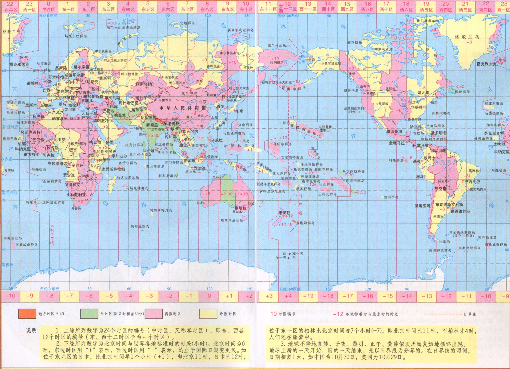

# 时区及时间

时区就是时间区域，主要是为了克服时间上的混乱，统一各地时间。地球上共有 24 个时区，东西各 12 个时区（东12与西12合二为一）。

## UTC 和 GMT

时区通常写成`+0800`，有时也写成`GMT +0800`，其实这两个是相同的概念。

GMT 是格林尼治标准时间（Greenwich Mean Time）。

UTC 是协调世界时间（Universal Time Coordinated），又叫世界标准时间，其实就是`0000`时区的时间。

## 时间换算

通常当有跨区域的会议时，一般大家都用 UTC 来公布，比如某个会议在`UTC 20:00 周三`开始，按照时间换算规则：

计算的区时=已知区时-（已知区时的时区-要计算区时的时区）

中国北京时间是：20:00 - ( 0 - 8 ) = 1天 + 04:00，即北京时间周四早上 04:00 。

## Linux 下调整时区

```
# ls /usr/share/zoneinfo
# ln -sf /usr/share/zoneinfo/PRC /etc/localtime
# ln -sf /usr/share/zoneinfo/Asia/Taipei /etc/localtime
```

临时调整一下：

```
$ TZ=PRC
$ date -R
$ TZ=Asia/Taipei
$ date -R
```

## 世界时区表


